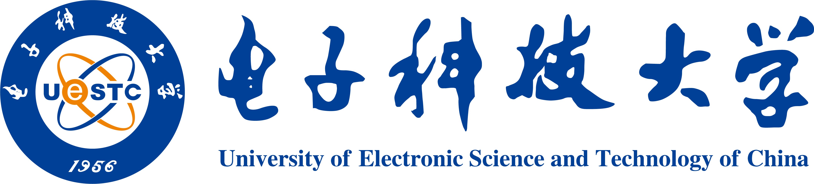

# PAIMON06: 高性能迷宫车
<!-- 

  

    
  

  

    
  

 -->

一辆全国一等奖的全部！从车上的每一颗螺丝到烧录文件的每一位HEX数据，全都在这里！

此项目是电子科技大学应用电子科技协会第十一届全国大学生光电设计竞赛（2023年）参赛作品，在西南赛区取得了第一名的成绩并在哈尔滨工业大学主办的全国总决赛中取得了全国一等奖的成绩。此项目包含了我们的全部的电路工程、全车建模、包含开发历史的软件与固件等信息。
## 🌟 团队成员
<table border="0" style="border:none; margin-left:0;">
  <tr>
    <td align="center">
      <a href="https://github.com/RC-Wu">
        
         
        <b>RC-Wu</b>
      </a>
    </td>
    <td align="center">
      <a href="https://github.com/Mxacz233">
        
         
        <b>Mxacz233</b>
      </a>
    </td>
    <td align="center">
      <a href="https://github.com/JimHans">
        
         
        <b>JimHans</b>
      </a>
    </td>
  </tr>
</table>

## 🗃️ 文件介绍
### 快速索引
这是一份功能快速索引，你可以通过这份索引快速找到你想要的文件。
#### 01.Software/软件部分：
#### 02.Firmware/固件部分：
|品牌与型号|类型|内容|
|:-:|:-:|:-:|
|DJI M2006电机|无刷电机|CAN通信驱动|
|瓴控云台电机|无刷电机|CAN通信驱动|
|BOSCH BMI088|陀螺仪|SPI通信驱动|
|NOOPLOOP激光测距|激光测距|UART-DMA通信驱动|
|-|通信协议|上下位机UART-DMA通信协议|
#### 03.CircuitBoard/电路部分：
|品牌与型号|类型|内容|
|:-:|:-:|:-:|
|STM32F407|核心小板|电路设计方案|
|BMI088|陀螺仪小板|电路设计方案|
|-|主板|电路设计方案|
|TPS54360|电源管理|电路设计方案|
|-|分电板|电路设计方案|
#### 04.Structure/机械部分：
|品牌与型号|类型|内容|
|:-:|:-:|:-:|
|DJI M2006电机+C610电调|无刷电机+电驱|最小驱控单元设计方案|
|格氏 6S航模电池|锂电池|含有电压检测和总开关的电池快拆座设计方案|
|-|全车|机械设计方案|
## 📜 竞赛题目

## 🛠️ 作品介绍

## 🏞️ 画廊