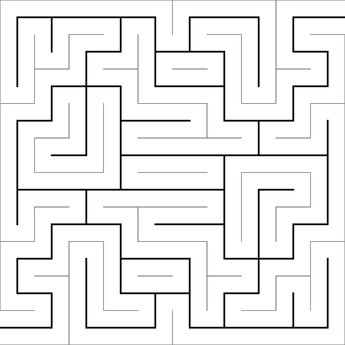
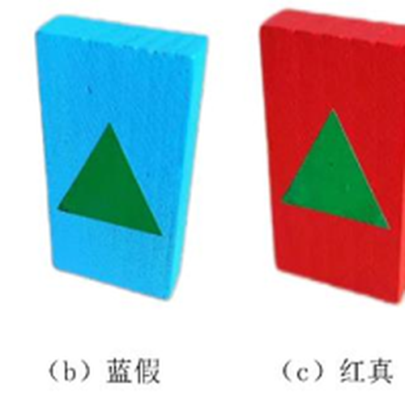

  

# PAIMON06: 高性能迷宫车

一辆全国一等奖的全部！从车上的每一颗螺丝到烧录文件的每一位HEX数据，全都在这里！

此项目是电子科技大学应用电子科技协会第十一届全国大学生光电设计竞赛（2023年）参赛作品，在西南赛区取得了第一名的成绩并在哈尔滨工业大学主办的全国总决赛中取得了全国一等奖的成绩。此项目包含了我们的全部的电路工程、全车建模、包含开发历史的软件与固件等信息。
## 🌟 团队成员
<table border="0" style="border:none; margin-left:0;">
  <tr>
    <td align="center">
      <a href="https://github.com/RC-Wu">
        
         
        <b>RC-Wu</b>
      </a>
    </td>
    <td align="center">
      <a href="https://github.com/Mxacz233">
        
         
        <b>Mxacz233</b>
      </a>
    </td>
    <td align="center">
      <a href="https://github.com/JimHans">
        
         
        <b>JimHans</b>
      </a>
    </td>
  </tr>
</table>

## 🗃️ 文件介绍
文件介绍部分将简短介绍项目的工程组成，并给出一份功能表格方便查阅。
### 01.Software/软件部分：
软件部分是
### 02.Firmware/固件部分：
固件部分是利用`CubeMX`和`KeilV5`联合开发的STM32固件，是一个完整工程。固件负责将上位机的决策信息传递给执行机构。
|品牌与型号|类型|内容|
|:-:|:-:|:-:|
|DJI M2006电机|无刷电机|CAN通信驱动|
|瓴控云台电机|无刷电机|CAN通信驱动|
|BOSCH BMI088|陀螺仪|SPI通信驱动|
|NOOPLOOP激光测距|激光测距|UART-DMA通信驱动|
|-|通信协议|上下位机UART-DMA通信协议|
### 03.CircuitBoard/电路部分：
电路部分是利用`Altium Designer`设计的电路板，是五个完整工程，包含核心小板、陀螺仪小板、主板、电源板、分电板五个工程。电路部分均是高度定制化的PCB，为整车集成度提供了大量的贡献。
|品牌与型号|类型|内容|
|:-:|:-:|:-:|
|STM32F407|核心小板|电路设计方案|
|BMI088|陀螺仪小板|电路设计方案|
|-|主板|电路设计方案|
|TPS54360|电源管理|电路设计方案|
|-|分电板|电路设计方案|
### 04.Structure/机械部分：
机械部分是利用`SolidWorks`设计的机械结构，是由多个.sldprt或.sldasm的子部件和一个整体的.sldasm总装配体组成的工程。机械部分是开发阶段对集成的考虑，使得全车紧凑装配成为可能。
|品牌与型号|类型|内容|
|:-:|:-:|:-:|
|DJI M2006电机+C610电调|无刷电机+电驱|最小驱控单元设计方案|
|格氏 6S航模电池|锂电池|含电压和开关的电池座设计方案|
|-|全车|机械设计方案|
## 📜 竞赛题目
### 1. 题目描述
#### 道具
- `场地`：一个4m×4m，10单元格×10单元格的迷宫中，随机选择8个单元格放置8块宝藏，每个单元格非联通边有隔板，地面有黑色循迹线。
- `藏宝图`：一张打印在A4纸上的迷宫缩略图，含有宝藏的单元格中心有黑色的点。
- `宝藏`：由红色或蓝色的积木贴上黄色圆形和绿色三角形组成，共八块

  |颜色|标签|类型|数量|
  |:-:|:-:|:-:|:-:|
  |红色|绿色三角形|红方真宝藏|3|
  |红色|黄色圆形|红方假宝藏|1|
  |蓝色|黄色圆形|蓝方真宝藏|3|
  |蓝色|绿色三角形|蓝方假宝藏|1|
  

    

      
      
场地

    

    

      
      
藏宝图

    

    

      
      
宝藏

    

  

#### 参赛车辆
参赛车辆有如下要求
- 尺寸合规
- 不得搭载恶意攻击功能
- 有限人工干涉，即从开始到完赛只能有放置车辆在场地入口、一键拍摄藏宝图、一键启动三次人工干涉
#### 抽象概念
- `阵营颜色`：由红色和蓝色两种颜色，分别代表红方和蓝方，一般由抽取决定。
- `识别正确数`：车辆碰倒己方真宝藏时，正确识别书加一。未碰倒宝藏、碰倒己方假宝藏、碰倒对方宝藏均不计入，并有对应惩罚。
- `完赛用时`：车辆从开始计时到抵达出口的时间。
### 2. 赛制规则
以下是一些和赛制规则相关的名词： 
- `积分赛`：单车计时赛，随机抽取`藏宝图`和`阵营颜色`，根据`完赛用时`和`识别正确数`综合打分。
- `对抗赛`：双车对抗赛，双方根据先后手分别抽取`藏宝图`和`阵营颜色`，在`识别正确数`相同的情况下，`完赛用时`较短的一方获胜，同时有一套双车纠缠重置规则。对抗赛进行两轮，每轮淘汰一半队伍，最终决出16支队伍进入全国总决赛。

西南赛区区赛采用`积分赛`+`对抗赛`的赛制：积分赛进行一轮，选择前64名进入对抗赛。对抗赛进行两轮，每轮淘汰一半队伍，最终决出16支队伍进入全国总决赛。

全国赛采用`对抗赛`的赛制：第一轮`对抗赛`在晋级一半队伍的基础上，参考积分赛规则根据赛中表现选择一部分未晋级队伍进行`对抗赛`，胜者与第一轮`对抗赛`晋级队伍共同参加第二轮`对抗赛`；第二轮`对抗赛`获胜的队伍获得全国一等奖。

### 3. 实况
- 校赛：成绩还可以，但是跑一半轮子掉了，真是令人贻笑大方。
- 西南赛区积分赛：识别正确数为3，满分，完赛用时为53秒，小计排名第二，第一名是重庆邮电大学的队伍，很强大，可惜因方案过于激进在对抗赛中失误。
- 西南赛区第一轮对抗赛：顺利完赛，但对手车辆出现问题，直至我方完赛仍未启动。
- 西南赛区第二轮对抗赛：对手车辆在第一轮对抗赛中出现问题，弃权。
- 全国赛第一轮对抗赛：对方为国防科技大学的队伍，对方车辆在直线行进速度优于我方，但转弯与识别速度不及我方，同时对方车辆在行进中出现失控，而后导致双方纠缠，最终我方险胜。
## 🛠️ 作品介绍
<!-- 

  

 -->

  <table style="width:100%; border-collapse: collapse;">
    <tr>
      <style="width:50%; text-align:center; padding:5px;">
         
        
部件图

    </tr>

1. 云台：由一个YAW轴云台电机、含碳纤维PLA打印法兰盘与支架、摄像头、摄像头补光灯小板组成，能够让摄像头始终朝向行进方向，便于第一时间识别。
2. 运动组：由四组运动单元组成，每组运动单元分别有麦克纳姆轮、M2006电机、C610电调各一个。集成后的运动单元使用XT30 2+2接口引出并连接至底层分电板。
3. 控制组：由一块触摸屏、一块ROCK PI 4B，一块与ROCK PI 4B尺寸与孔位相同，供电、信号接口对应的主板构成的三明治结构，集成后的控制组引出一个TypeC供电连接至电源板和30pinFPC排线连接至底层分电板。
4. 电源组：由电池组、电池、和一块电源板组成，电池组可以实时查看电池电压，避免欠压；电源可以快速更换；电源板将电池分为需要的电压和接口传递至底层分电板和主板。
5. 保险杠组：由铝方管、钣金裙甲、含碳纤维PLA打印转角组成，能够有效撞倒宝藏，同时避免与场地和对方车辆碰撞导致的内部损坏。
6. 传感器组：由四组传感单元组成，每组传感单元分别有四路灰度传感器、激光距离传感器各一个，能够后反馈四个方向的距离和地面路线。

综上，本作品其实不存在功能意义上的正面，任何一个方向均可完成前进与识别功能。作品从根本上消除了迷宫中转向所需要的大量时间，这种构型为取得优异成绩提供了大量帮助。

## 🏞️ 画廊

  <table style="width:100%; border-collapse: collapse;">
    <tr>
      <td style="width:33.33%; text-align:center; padding:5px;">
         
        
第一代角度锁定测试

      </td>
      <td style="width:33.33%; text-align:center; padding:5px;">
         
        
搭建校内场地

      </td>
      <td style="width:33.33%; text-align:center; padding:5px;">
         
        
搭建好的校内场地

      </td>
    </tr>
    <tr>
      <td style="width:33.33%; text-align:center; padding:5px;">
         
        
电源板、控制板和分电板

      </td>
      <td style="width:33.33%; text-align:center; padding:5px;">
         
        
第二代，理线、集成单元、原神贴纸

      </td>
      <td style="width:33.33%; text-align:center; padding:5px;">
         
        
二代角度摄像头锁定测试

      </td>
    </tr>
    <tr>
      <td style="width:33.33%; text-align:center; padding:5px;">
         
        
省赛场地

      </td>
      <td style="width:33.33%; text-align:center; padding:5px;">
         
        
第三代，碳板、黑色件、黑色漆

      </td>
      <td style="width:33.33%; text-align:center; padding:5px;">
         
        
bilibili视频封面

      </td>
    </tr>
    <tr>
      <td style="width:33.33%; text-align:center; padding:5px;">
         
        
决赛现场

      </td>
      <td style="width:33.33%; text-align:center; padding:5px;">
         
        
颁奖典礼

      </td>
      <td style="width:33.33%; text-align:center; padding:5px;">
         
        
国赛合影

      </td>
    </tr>
    <tr>
      <td style="width:33.33%; text-align:center; padding:5px;">
         
        
吃了蘸酱菜辣椒而面露难色的队友

      </td>
      <td style="width:33.33%; text-align:center; padding:5px;">
         
        
松花江边

      </td>
      <td style="width:33.33%; text-align:center; padding:5px;">
         
        
圣索菲亚大教堂

      </td>
    </tr>
  </table>
